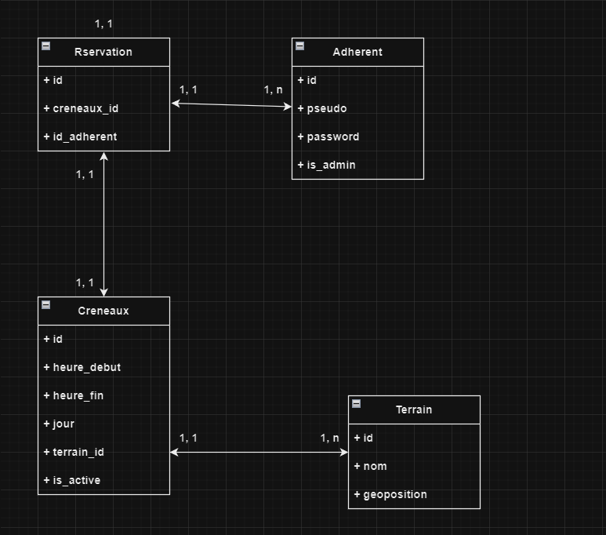

# Projet de Réservation de Terrains de Badminton

## Table des matières

- [Projet de Réservation de Terrains de Badminton](#projet-de-réservation-de-terrains-de-badminton)
  - [Table des matières](#table-des-matières)
  - [Lancer le Projet](#lancer-le-projet)
    - [Installer les Dépendances](#installer-les-dépendances)
  - [Conception :](#conception-)
    - [Dictionnaire des Données](#dictionnaire-des-données)
      - [Terrains](#terrains)
      - [Créneaux](#créneaux)
      - [Adhérents](#adhérents)
      - [Réservations](#réservations)
    - [Afficher tous les terrains disponibles](#afficher-tous-les-terrains-disponibles)
    - [Afficher les détails d'un terrain particulier](#afficher-les-détails-dun-terrain-particulier)
    - [Afficher les créneaux disponibles pour un terrain donné](#afficher-les-créneaux-disponibles-pour-un-terrain-donné)
    - [Réserver un créneau sur un terrain](#réserver-un-créneau-sur-un-terrain)
    - [Afficher les réservations d'un adhérent](#afficher-les-réservations-dun-adhérent)
    - [Annuler une réservation](#annuler-une-réservation)
    - [Afficher les détails d'un adhérent](#afficher-les-détails-dun-adhérent)
    - [Effectuer une réservation sur un terrain spécifique](#effectuer-une-réservation-sur-un-terrain-spécifique)
    - [Dictionnaire des Données](#dictionnaire-des-données-1)
    - [Tableau Récapitulatif des Ressources](#tableau-récapitulatif-des-ressources)
  - [Modèle Conceptuel des Données (MCD)](#modèle-conceptuel-des-données-mcd)
  - [Remarques](#remarques)
  - [Références](#références)

## Lancer le Projet

### Installer les Dépendances

Assurez-vous d'avoir [Node.js](https://nodejs.org/) installé sur votre machine.

## Conception :

### Dictionnaire des Données

#### Terrains

- **Ressource :** `/terrains`
- **URL :** `/terrains`
- **Méthodes HTTP :** GET, POST
- **Paramètres d'URL/Variations :** N/A
- **Commentaires :** Liste des terrains, ajout d'un terrain

#### Créneaux

- **Ressource :** `/creneaux`
- **URL :** `/creneaux`
- **Méthodes HTTP :** GET, POST, DELETE
- **Paramètres d'URL/Variations :** N/A
- **Commentaires :** Liste des créneaux, ajout et suppression

#### Adhérents

- **Ressource :** `/adherents`
- **URL :** `/adherents`
- **Méthodes HTTP :** GET, POST
- **Paramètres d'URL/Variations :** N/A
- **Commentaires :** Liste des adhérents, ajout d'un adhérent

#### Réservations

- **Ressource :** `/reservations`
- **URL :** `/reservations`
- **Méthodes HTTP :** GET, POST, DELETE
- **Paramètres d'URL/Variations :** N/A
- **Commentaires :** Liste des réservations, ajout et suppression

### Afficher tous les terrains disponibles

- **Type de requête :** GET
- **Endpoint :** `/terrains`
- **Description :** Renvoie la liste de tous les terrains disponibles.

### Afficher les détails d'un terrain particulier

- **Type de requête :** GET
- **Endpoint :** `/terrains/:id`
- **Description :** Renvoie les détails d'un terrain spécifique en fonction de son identifiant.

### Afficher les créneaux disponibles pour un terrain donné

- **Type de requête :** GET
- **Endpoint :** `/terrains/:id/creneaux`
- **Description :** Renvoie les créneaux disponibles pour la réservation sur un terrain spécifique.

### Réserver un créneau sur un terrain

- **Type de requête :** POST
- **Endpoint :** `/terrains/:id/creneaux/reserver`
- **Description :** Permet à un adhérent de réserver un créneau sur un terrain spécifique.

### Afficher les réservations d'un adhérent

- **Type de requête :** GET
- **Endpoint :** `/adherents/:id/reservations`
- **Description :** Renvoie les réservations effectuées par un adhérent en fonction de son identifiant.

### Annuler une réservation

- **Type de requête :** DELETE
- **Endpoint :** `/reservations/:id`
- **Description :** Annule une réservation en fonction de son identifiant.

### Afficher les détails d'un adhérent

- **Type de requête :** GET
- **Endpoint :** `/adherents/:id`
- **Description :** Renvoie les détails d'un adhérent en fonction de son identifiant.

### Effectuer une réservation sur un terrain spécifique

- **Type de requête :** POST
- **Endpoint :** `/terrains/:id/reserver`
- **Description :** Permet à un adhérent de réserver un créneau sur un terrain spécifique.

### Dictionnaire des Données

| Ressource         | Code            | Type | Obligatoire ? | Taille | Commentaires |
| ------------------ | --------------- | ---- | ------------- | ------ | ------------ |
| Terrains           | terrain_id      | AN   | Oui           | 1      | Identifiant unique du terrain (A, B, C, D) |
| Créneaux           | creneau_id      | AN   | Oui           |        | Identifiant unique du créneau |
| Adhérents          | adherent_id     | AN   | Oui           |        | Identifiant unique de l'adhérent |
| Réservations       | reservation_id  | AN   | Oui           |        | Identifiant unique de la réservation |
| Date et Heure      | datetime        | D    | Oui           |        | Date et heure de la réservation |
| Etat de la réservation | status          | A    | Oui           |        | Ne peut prendre que 3 valeurs : to_confirm, confirmed, canceled  |
| Statut Réservation attente | to_confirm      | A    | Oui           |        | Valeur possible de Etat de la reservation, une reservation confirmée peut être annulé ou confirmée |
| Statut Réservation confirmée | confirmed          | A    | Oui           |        | Valeur possible de Etat de la réservation. Ne s'applique sur sur to_confirm. Etat lock |
| Statut Réservation annulée| canceled          | A    | Oui           |        | ne s'applique que sur un éat to_confirm, ce statut ne peut plus changer aprés |

| ------------------ | --------------- | ---- | ------------- | ------ | ---------------------------------------------- |
| Ressource          | Code            | Type | Obligatoire ? | Taille | Commentaires                                   |
| ------------------ | --------------- | ---- | ------------- | ------ | ---------------------------------------------- |
| Terrains           | id_terrain      | N    | Oui           |        | Identifiant unique du terrain                  |
| Nom                | nom             | A    | Oui           | 1      | A, B, C, D                                     |
| Lieu               | lieu            | A    | Oui           | 100    | Lieu du terrain                                |
| Disponibilité      | disponible      | B    | Oui           |        | true, false                                    |
| ------------------ | --------------- | ---- | ------------- | ------ | ---------------------------------------------- |
| Créneaux           | id_creneau      | N    | Oui           |        | Identifiant unique du créneau                  |
| Date de début      | debut           | D    | Oui           |        | Date de début(ex: 2023-12-25 20:00:00)         |
| Date de fin        | fin             | D    | Oui           |        | Date de fin(ex: 2023-12-25 20:45:00)           |
| Jour               | jour            | A    | Oui           |        | lundi, mardi, mercredi, jeudi, vendredi, samedi|
| ------------------ | --------------- | ---- | ------------- | ------ | ---------------------------------------------- |
| Adhérents          | id_adherent     | N    | Oui           |        | Identifiant unique de l'adhérent               |
| Pseudo             | pseudo          | A    | Oui           | 50     | Pseudo unique par adhérent                     |
| Role               | administrateur  | B    | Oui           |        | true, false                                    |
| ------------------ | --------------- | ---- | ------------- | ------ | ---------------------------------------------- |
| Réservations       | id_reservation  | N    | Oui           |        | Identifiant unique de la réservation           |
| Numéro             | numero          | N    | Oui           |        | Numéro de réservation unique pour l'adhérent   |
| Date et Heure      | date            | D    | Oui           |        | Date et heure de la réservation                |
| Statut Réservation | statut          | A    | Oui           |        | to_confirm, confirmed, canceled                |
| ------------------ | --------------- | ---- | ------------- | ------ | ---------------------------------------------- |

### Tableau Récapitulatif des Ressources

| Ressource         | URL              | Méthodes HTTP       | Paramètres d'URL/Variations | Commentaires                        |
|-------------------|------------------|---------------------|-----------------------------|------------------------------------|
| Terrains          | `/terrains`      | GET, POST           | `/terrains/{id-terrain}`| Liste des terrains, ajout d'un terrain |
| Créneaux          | `/creneaux`      | GET, POST, DELETE   | N/A                         | Liste des créneaux, ajout et suppression |
| Adhérents         | `/adh`     | GET, POST           | N/A                         | Liste des adhérents, ajout d'un adhérent |
| Réservations      | `/reservations`  | GET, POST, DELETE   | N/A                         | Liste des réservations, ajout et suppression |

Nom de la ressource | URL | Méthodes HTTP | Paramètres d’URL/Variations | Commentaires
--- | --- | --- | --- | ---
Liste des Terrains | `/terrains` | GET | N/A | Liste des terrains disponibles
Détails d'un Terrain | `/terrains/{id-terrain}` | GET | N/A | Informations détaillées sur un terrain spécifique
Réserver un Terrain | `/terrains/{id-terrain}/reservations` | POST | N/A | Effectuer une réservation pour un terrain spécifique

Liste des adhérents| `/adh` | GET | N/A | Liste des Adhérents
Liste des Réservations d'un adhérent| `/terrains/{id-terrain}/reservations/{id-reservation}/adh` | GET | N/A | Liste des réservations pour un terrain spécifique
Annuler une Réservation d'un adhérent  | `/terrains/{id-terrain}/reservations/{id-reservation}` | DELETE | N/A | Annuler une réservation pour un terrain spécifique
Détails d'un Adhérent 

## Modèle Conceptuel des Données (MCD)

## Remarques

Ajoutez ici vos remarques sur le travail réalisé, les difficultés rencontrées, etc.

## Références

Ajoutez ici la liste des références (sites web, cours, livres, articles, billets de blog, etc.) qui vous ont aidé à concevoir et développer votre système.
